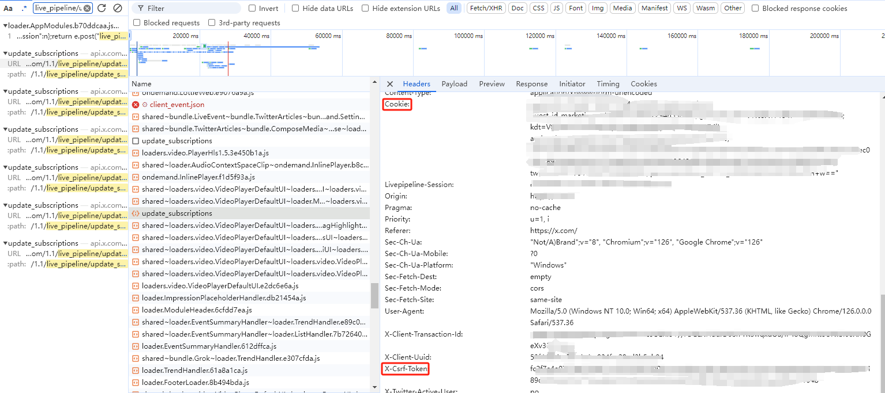

<h1 style="text-align: center;">Twitter 快速开始</h1>

### 参数获取

在使用Twitter服务前，你需要获取一些必要参数，并将参数填入`duck.yaml`配置文件中。

1. 首先需要在浏览器登录Twitter账号。
2. `F12` 或 `Ctrl+Shift+I` 打开开发者工具，选择`Network`标签。
3. `F5` 或 `Ctrl+R` 刷新页面。
4. 在`Network`标签中，`Ctrl+F` 搜索 `live_pipeline/update_subscriptions`。
5. 点击 `live_pipeline/update_subscriptions`，在 `Request Headers` 标签，找到 `x-csrf-token`、`Cookie`、`Authorization` 参数，复制参数值并将其填入`duck.yaml`配置文件中。

